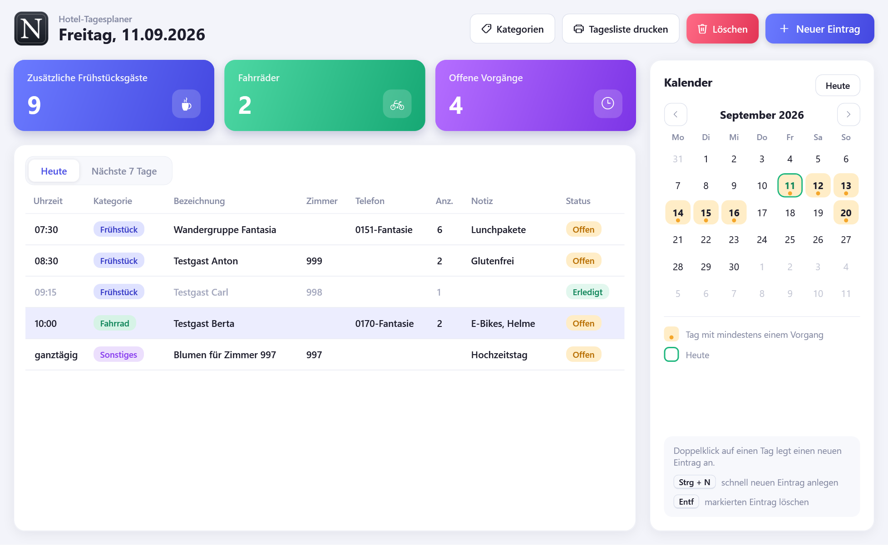
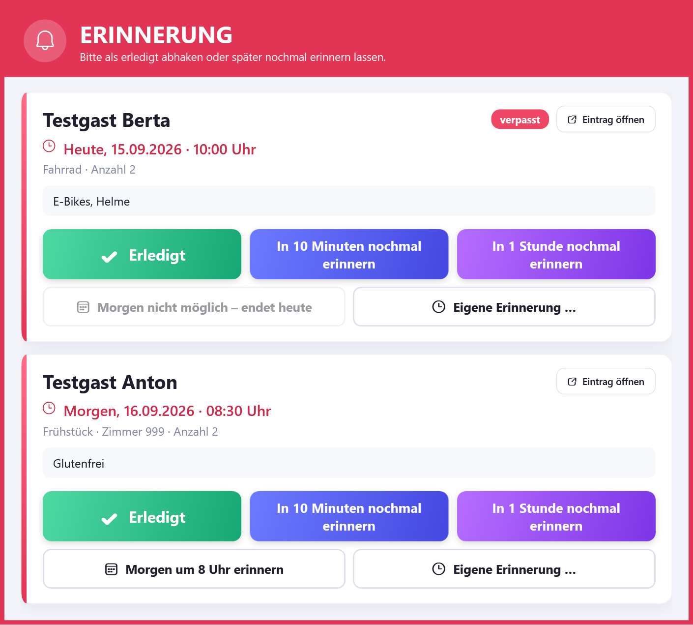
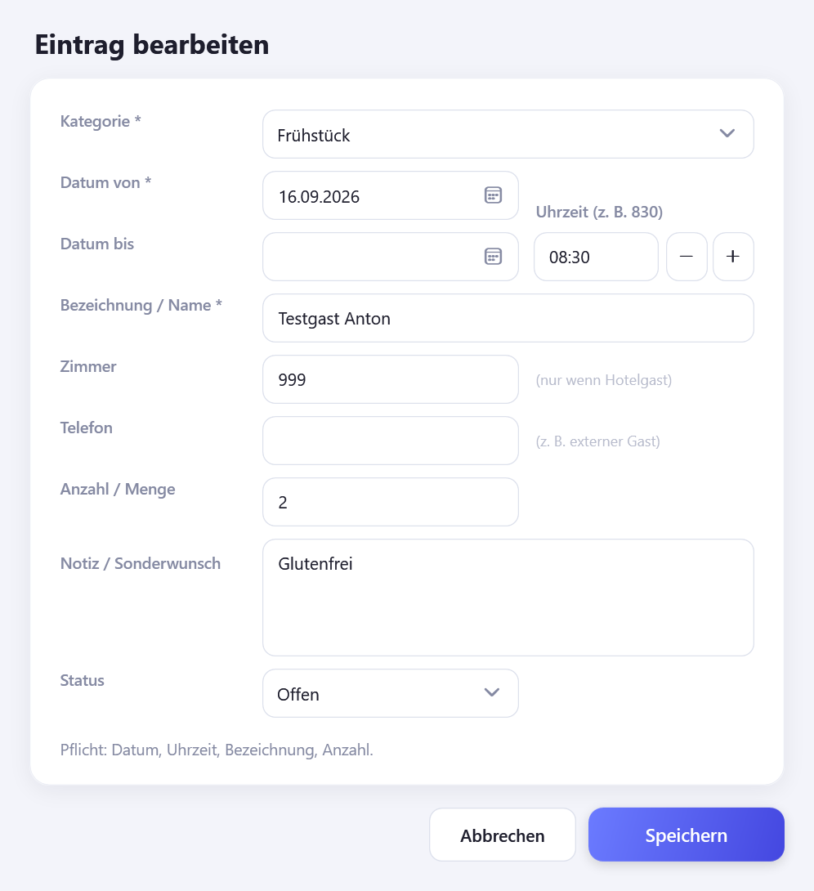
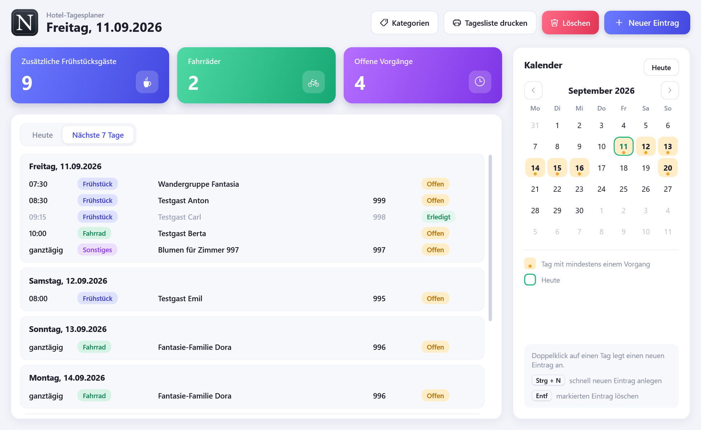
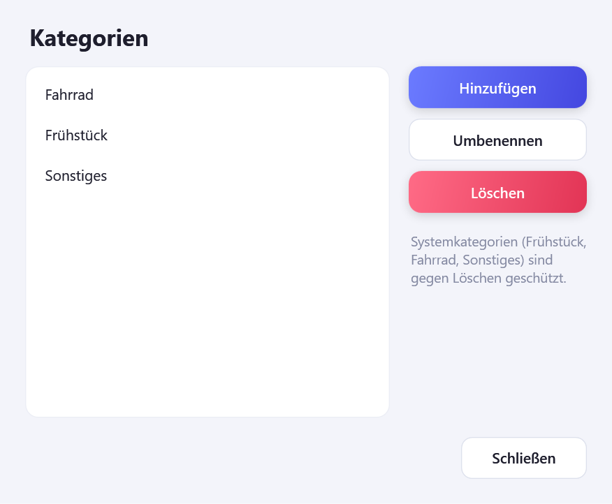
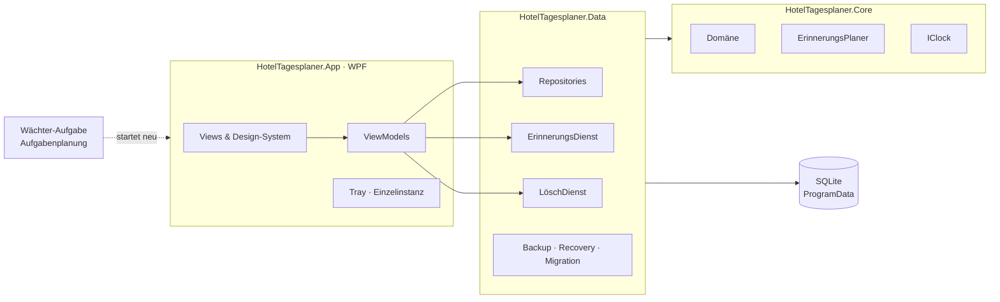

  

<h1 align="center">Hotel-Tagesplaner</h1>

  Lokale Windows-App für den Hotelalltag – Frühstücksgäste, Fahrradverleih, Sonderwünsche 
  und Erinnerungen, die man nicht übersehen kann.

  
  
  
  
  
  

> **English summary** — A local Windows desktop app (C# 12, .NET 8, WPF, SQLite) in daily
> production at a small hotel. It complements the booking system with the small operational
> tasks it doesn't cover – extra breakfast guests, bike rentals, special requests – and makes
> sure none of them gets forgotten: unmissable reminders, three staff accounts sharing one
> database on one laptop, and privacy by design (fully offline, no telemetry, automatic
> deletion of past records). Built in one week in September 2026 with Claude Code as an AI
> pair programmer; requirements, privacy rules, design decisions and acceptance testing by me.
> **The source code is private – access on request.**

Alle Screenshots zeigen ausschließlich Fantasiedaten.

---

## Worum geht es?

Das Buchungssystem des Hotels verwaltet Zimmer und Buchungen – aber nicht die vielen kleinen
Vorgänge des Tagesgeschäfts: der zusätzliche Frühstücksgast um 7:30 Uhr, zwei Leihräder für
10 Uhr, Blumen zum Hochzeitstag. Solche Dinge brauchen einen festen Platz und eine Erinnerung
zur richtigen Zeit – ohne ein weiteres großes System und ohne Gästedaten in eine Cloud zu geben.

Der **Hotel-Tagesplaner** ist genau dafür gebaut: eine schlanke Desktop-App auf dem
Hotel-Laptop, die von allen Mitarbeiter-Konten gemeinsam genutzt wird und sich meldet,
bevor etwas vergessen wird.

## Funktionen

**Planen**
- Tagesliste und Ausblick auf die nächsten 7 Tage
- Eigener Monatskalender: Tage mit Vorgängen sind markiert, Doppelklick legt einen Eintrag an
- Kategorien Frühstück, Fahrrad und Sonstiges (erweiterbar) mit passenden Pflichtfeldern
- Schnelle Uhrzeit-Eingabe: 09:00 vorbelegt, `830` statt `08:30` tippen, −/+ in 15-Minuten-Schritten
- Zähler für zusätzliche Frühstücksgäste, Fahrräder und offene Vorgänge
- Tagesliste drucken

**Erinnern**
- Automatische Erinnerungen: am Vortag um 17:00 und 17:30 Uhr, am Tag eine Stunde vorher
- Unübersehbares Erinnerungsfenster: immer im Vordergrund, pulsierender Rahmen, blinkende
  Taskleiste, Signalton alle 10 Sekunden – ohne beim Tippen den Fokus zu stehlen
- „Erledigt" mit Sicherheitsrückfrage, „In 10 Minuten" oder „In 1 Stunde nochmal erinnern"
- „Morgen um 8 Uhr" oder ein eigener Zeitpunkt – nur bis zum letzten Tag des Vorgangs,
  denn danach wird er automatisch gelöscht und die Erinnerung käme nie an
- Verpasste Erinnerungen (Laptop aus, Ruhezustand) erscheinen sofort beim Start bzw. Aufwachen

**Zuverlässig im Betrieb**
- Drei Windows-Konten, eine gemeinsame Datenbank: Änderungen erscheinen in allen Sitzungen,
  eine quittierte Erinnerung verschwindet überall
- Läuft im Hintergrund weiter (Symbol neben der Uhr); eine geplante Aufgabe startet die App
  nach einem Absturz innerhalb von 5 Minuten neu
- Integritätsprüfung beim Start mit automatischer Wiederherstellung aus der Sicherung
- Installer mit Rechtevergabe, Autostart und Deinstallation mit Nachfrage zur Datenlöschung

## Datenschutz by Design

| Grundsatz | Umsetzung |
|---|---|
| Komplett lokal | Keine Cloud, keine Netzwerkfunktionen, keine Telemetrie |
| Datensparsamkeit | Vorgänge werden automatisch gelöscht, sobald ihr Datum vorbei ist – kein Archiv, kein Papierkorb. Offene Vorgänge vom Vortag werden vorher noch einmal angezeigt. |
| Sicheres Löschen | SQLite `secure_delete`, WAL-Checkpoint und VACUUM |
| Kurze Nachwirkung | Höchstens 3 rollierende Tagessicherungen, erstellt *nach* dem Löschlauf |
| Saubere Protokolle | Keine Namen, Zimmer oder Telefonnummern in Logdateien |
| Fantasiedaten | Entwicklung, Tests und Screenshots ausschließlich mit erfundenen Daten |
| Bewusst weggelassen | Cloud-Sync, Smartphone-App, Web-Zugriff, Gästekartei, Statistiken, Marketing |

## Screenshots

<table>
  <tr>
    <td width="50%"><b>Erinnerungsfenster</b> Erledigt mit Rückfrage oder später erinnern – auch morgen früh oder zu einer eigenen Zeit. Verpasste Erinnerungen sind markiert.</td>
    <td width="50%"><b>Eintrag bearbeiten</b> Pflichtfelder passen sich der Kategorie an; Uhrzeit ohne Doppelpunkt eintippen oder mit −/+ stellen.</td>
  </tr>
  <tr>
    <td></td>
    <td></td>
  </tr>
  <tr>
    <td><b>Nächste 7 Tage</b> Ausblick mit Kategorie- und Status-Marken.</td>
    <td><b>Kategorien</b> Eigene Kategorien; Systemkategorien sind geschützt.</td>
  </tr>
  <tr>
    <td></td>
    <td></td>
  </tr>
</table>

## Technik

| Bereich | Umsetzung |
|---|---|
| Sprache & Plattform | C# 12, .NET 8, Windows 10/11 |
| Oberfläche | WPF mit MVVM, eigenes Design-System (Styles und Control-Templates), eigener Monatskalender |
| Daten | SQLite über Microsoft.Data.Sqlite, WAL-Modus, idempotente Schema-Migrationen |
| Tests | xUnit, 72 Tests mit temporären Fantasie-Datenbanken und steuerbarer Uhr (`IClock`) |
| Windows-Integration | Tray-Symbol, Einzelinstanz pro Sitzung, Aufgabenplanung, `FlashWindowEx`, DWM |
| Auslieferung | Inno Setup 6, PowerShell-Skripte für Build und Icon-Erzeugung |

## Architektur

Beim Start und bei jedem Tageswechsel läuft immer dieselbe Reihenfolge:

1. **Recovery** – Integritätsprüfung, bei Bedarf Wiederherstellung aus der Sicherung
2. **Migration** – Datenbankschema auf den aktuellen Stand bringen
3. **Rückblick** – offene Vorgänge vom Vortag anzeigen
4. **Löschlauf** – vergangene Vorgänge sicher entfernen
5. **Sicherung** – Tageskopie *nach* dem Löschen
6. **Oberfläche & Erinnerungen** – Ansichten aktualisieren, fällige Erinnerungen anzeigen

## Entstehung & meine Rolle

Mein erstes eigenes Softwareprojekt – entstanden in einer Woche (5. bis 11. September 2026),
seitdem im täglichen Einsatz und nach Rückmeldungen aus dem Betrieb weiterentwickelt.

- **Anforderungen:** Bedarf aus dem Hotelalltag aufgenommen, Funktionsumfang, Datenschutz-Regeln,
  Abgrenzung und Abnahmekriterien schriftlich festgelegt
- **Umsetzung mit KI:** gemeinsam mit [Claude Code](https://claude.com/claude-code) als
  KI-Pair-Programmer, in Phasen von der Systemprüfung über Kern, Datenbank und Oberfläche bis zum Installer
- **Entscheidungen & Abnahme im Echtbetrieb**, zum Beispiel:
  - Sicherung erst *nach* dem Löschlauf, damit gelöschte Daten kürzer nachwirken
  - Eigener Kalender, weil die Markierung im Standard-Kalender nicht sichtbar genug war
  - Erinnerungen deutlich auffälliger gestaltet, Schlummern von 1 auf 10 Minuten geändert,
    später „In 1 Stunde" ergänzt
  - Modernes Redesign nach eigener Designvorlage und neu aufgebautes App-Icon
  - Erinnerungen auf „morgen 8 Uhr" oder eine eigene Zeit verschiebbar – aber gesperrt, wenn der
    Vorgang bis dahin schon gelöscht wäre, damit keine Erinnerung still verloren geht
  - Uhrzeit-Eingabe ohne Doppelpunkt, weil Shift + Doppelpunkt im Alltag bei jedem Eintrag bremst

## Versionen

| Version | Highlights |
|---|---|
| 1.0 | Erste produktive Version: Installer, Rechte, Autostart, sicheres Löschen |
| 1.0.3 | Sicherung nach dem Löschlauf – Nachwirkung von 3 auf 2 Tage verkürzt |
| 1.0.6 – 1.0.8 | Eigener Monatskalender mit gut sichtbarer Markierung |
| 1.1.0 | Unübersehbare Erinnerungen, Hintergrundbetrieb, Wächter-Aufgabe |
| 1.1.1 | „In 10 Minuten nochmal erinnern" |
| 1.2.0 | Modernes Redesign, „In 1 Stunde nochmal erinnern" |
| 1.2.1 | Neu aufgebautes App-Icon |
| 1.3.0 | „Morgen um 8 Uhr" und eigene Erinnerungszeit; Bearbeiten lässt quittierte Erinnerungen in Ruhe |
| 1.3.1 | Uhrzeit 09:00 vorbelegt, Eingabe ohne Doppelpunkt, −/+ in 15-Minuten-Schritten |

## Quellcode

Der Quellcode liegt in einem privaten Repository mit vollständiger Versionshistorie.
Zugang gebe ich auf Anfrage gern frei.

Name und Logo NANIS gehören dem Hotel. Alle Rechte vorbehalten.
